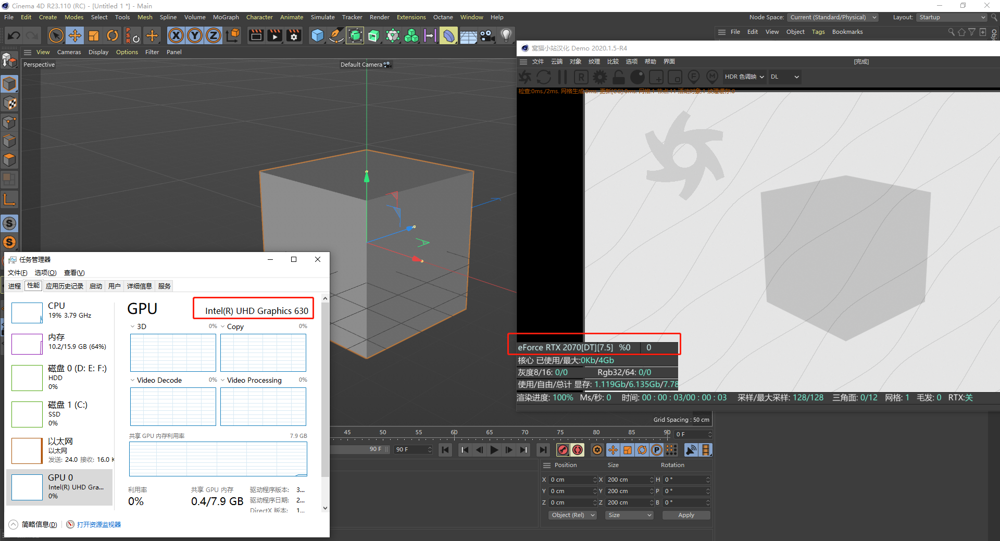
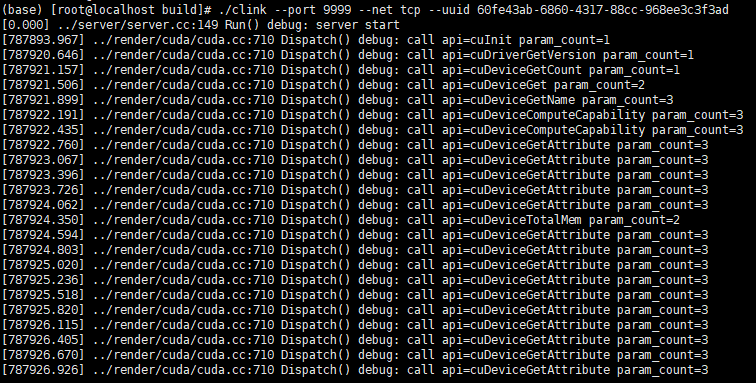
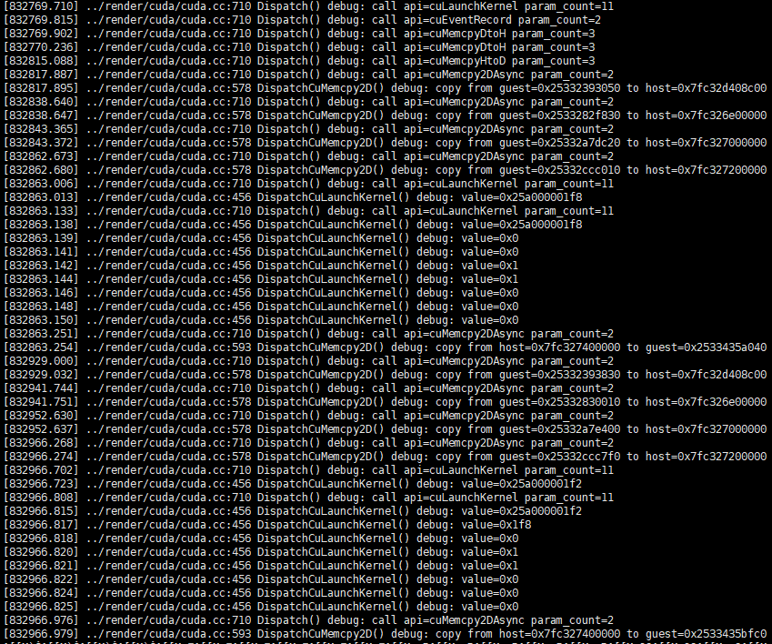

# Clink: A c/s render api transport

## Goal
1. Transport render api request through network.
2. Supply fake render client dll to gather all render api, pack them up and send to server point.
3. Handle render api on server side, then pack the response up and send back to client.

## Screenshot

## Compile & Run

### Client side
Build Environment: vs2019 + sdk19041

Usage:
1. Set environment variables CLINK_HOST for server address.
2. Set environment variables CLINK_PORT for server port.
3. Set environment variables CLINK_NET for transport protocol, tcp or kcp.
4. Set environment variables CLINK_UUID with uuid string.
5. Put fake cuda dlls into the path where the execute file exists, the dll would be loaded by the program automatically.

### Server side
mkdir build && meson compile -c build 
Tips: Cuda 12.1 or newer needs to be installed completely on the host.

Usage: 
`./clink --port 9999 --net tcp --uuid 60fe43ab-6860-4317-88cc-968ee3c3f3ad`

## Current Status
1. We handled about 70 functions of cuda 12.1 driver api to make cinema4d oc-render work on any computer without nvidia graphics card.
2. It is proved that we can use fake cuda dll to supply cuda render engine for application on windows.
3. By the way, if it can work properly over a network, then it should certainly be able to operate correctly within a guest/host environment on a virtual machine.
